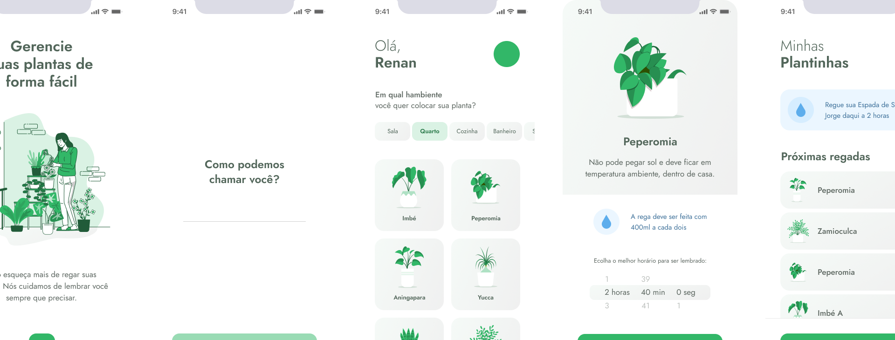

<div align="center">
  
</div>

<br>

<p align="center">
  
</p>

# NLW#05 - PlantManager
Um aplicativo de fácil uso e muito intuitivo para ajudar as pessoas a gerenciar o cuidado com suas plantas!<br>
O Projeto está sendo desenvolvido no programa rocketseat PLUS e tem o seu foco em uma aplicação `Mobile` utilizando Typescript e ReactNative. <br>

## Instalação
```bash
# Faça o clone do repositório

# Faça a instalação das depêndencias
  npm i
# Configurar a API localmente
  json-server ./src/services/server.json --host (seuIP) --port 3333
# Executando o projeto no ambiente de desenvolvimento
  expo start
```

## Tecnlogias
Este projeto foi desenvolvido utilizando:
- [x] React Native
- [x] Typescript
- [x] Expo
  - [x] [@expo/vector-icons](https://docs.expo.dev/guides/icons/#expovector-icons)
  - [x] [@expo-google-fonts](https://github.com/expo/google-fonts)
  - [x] [ReactNavigation](https://reactnavigation.org/)
  - [x] [SafeAreaContext](https://docs.expo.dev/versions/latest/sdk/safe-area-context/)
  - [x] [Axios](https://axios-http.com/ptbr/)
  - [x] [json-server](https://github.com/typicode/json-server)
  - [x] [react-native-svg](https://docs.expo.dev/versions/latest/sdk/svg/)

## ✔️ Autores

- [Renan Fachin](https://github.com/RenanFachin/)

## 📄 Professor

- [Rodrigo Gonçalves](https://github.com/rodrigorgtic)

## 📄 Referência

- [Rockeseat](https://www.rocketseat.com.br/)